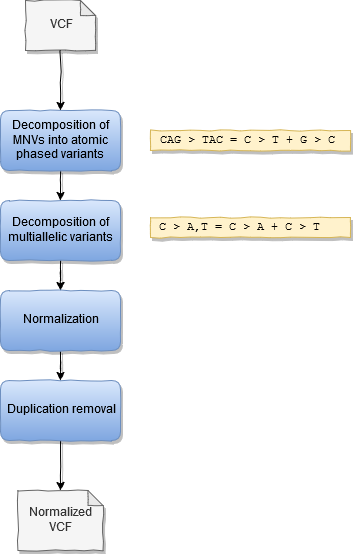

## TRON variant normalization pipeline

This pipeline aims at normalizing variants represented in a VCF into the convened normal form. 
The variant normalization is based on the implementation in bcftools. The pipeline is implemented on the Nextflow framework.
 
The pipeline consists of the following steps:
 * Variant filtering (optional)
 * Decomposition of MNPs into atomic variants (ie: AC > TG is decomposed into two variants A>T and C>G) (optional).
 * Decomposition of multiallelic variants into biallelic variants (ie: A > C,G is decomposed into two variants A > C and A > G)
 * Trim redundant sequence and left align indels, indels in repetitive sequences can have multiple representations
 * Remove duplicated variants
 
The output consists of:
 * The normalized VCF
 * Summary statistics before and after normalization





 ### How to run it

 ```
 $ nextflow run tron-bioinformatics/tron-variant-normalization -r v1.0.0 --help
 
 TronFlow VCF normalization v${VERSION}

Usage:
    nextflow run main.nf --input_files input_files --reference reference.fasta


Input:
    * input_files: the path to a tab-separated values file containing in each row the sample name  and path to the VCF file
    The input file does not have header!
    Example input file:
    sample1	/path/to/your/file.vcf
    sample2	/path/to/your/file2.vcf
    * reference: path to the FASTA genome reference (indexes expected *.fai, *.dict)

Optional input:
    * output: the folder where to publish output
    * skip_decompose_complex: flag indicating not to split complex variants (ie: MNVs and combinations of SNVs and indels)
    * filter: specify the filter to apply if any (e.g.: PASS), only variants with this value will be kept

Output:
    * Normalized VCF file
    * Tab-separated values file with the absolute paths to the preprocessed BAMs, preprocessed_bams.txt
    * Summary statistics before and after normalization
 ```
 

## References

* Danecek P, Bonfield JK, Liddle J, Marshall J, Ohan V, Pollard MO, Whitwham A, Keane T, McCarthy SA, Davies RM, Li H. Twelve years of SAMtools and BCFtools. Gigascience. 2021 Feb 16;10(2):giab008. doi: 10.1093/gigascience/giab008. PMID: 33590861; PMCID: PMC7931819.
* Adrian Tan, Gonçalo R. Abecasis and Hyun Min Kang. Unified Representation of Genetic Variants. Bioinformatics (2015) 31(13): 2202-2204](http://bioinformatics.oxfordjournals.org/content/31/13/2202) and uses bcftools [Li, H. (2011). A statistical framework for SNP calling, mutation discovery, association mapping and population genetical parameter estimation from sequencing data. Bioinformatics (Oxford, England), 27(21), 2987–2993. 10.1093/bioinformatics/btr509
* Di Tommaso, P., Chatzou, M., Floden, E. W., Barja, P. P., Palumbo, E., & Notredame, C. (2017). Nextflow enables reproducible computational workflows. Nature Biotechnology, 35(4), 316–319. 10.1038/nbt.3820